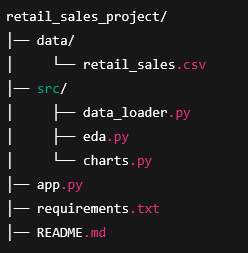
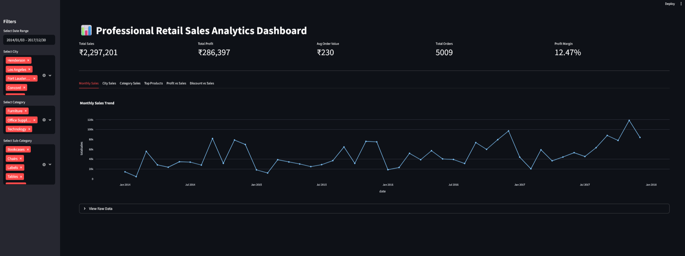

# Retail Sales Analytics Dashboard

A clean, professional, interactive dashboard for retail sales analysis using Python, Pandas, Plotly, and Streamlit.

## Project Structure


## Dashboard Screenshots
### KPI Overview


### Interactive Charts


## Features
- KPI Cards (Total Sales, Total Profit, Avg Order Value, Profit Margin, Total Orders)
- Monthly Sales Trend
- City-wise Sales
- Category-wise Sales
- Top 10 Products
- Profit vs Sales Scatter
- Discount vs Sales Bubble
- Dynamic Filters: Date, City, Category, Sub-Category
- Raw Data Viewer

## How to Run Locally
```bash
pip install -r requirements.txt
streamlit run app.py

